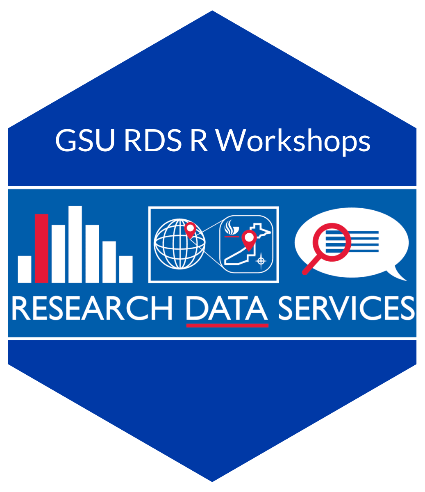

# Website for GSU Data Services Workshops

🔗 https://joshuafayallen.github.io/research-data-services-r-workshops/

## Colors

-   website background: #D9E3E4
-   headings: #97CAEB

## Attribution

Much of the content is based on [https://github.com/uo-ec607/lectures](https://github.com/uo-ec607/lectures)  by Dr. Grant McDermott and and/or [https://talks.andrewheiss.com/2021-seacen/01-tidyverse.html](https://talks.andrewheiss.com/2021-seacen/01-tidyverse.html) by Dr. Andrew Heiss. The website template are modifications to by [Dr. Mine Çetinkaya-Rundel](https://sta210-s22.github.io/website/course-team.html)

 This work is licensed under a <a rel="license" href="http://creativecommons.org/licenses/by-nc/4.0/">Creative Commons Attribution-NonCommercial 4.0 International License</a>.
